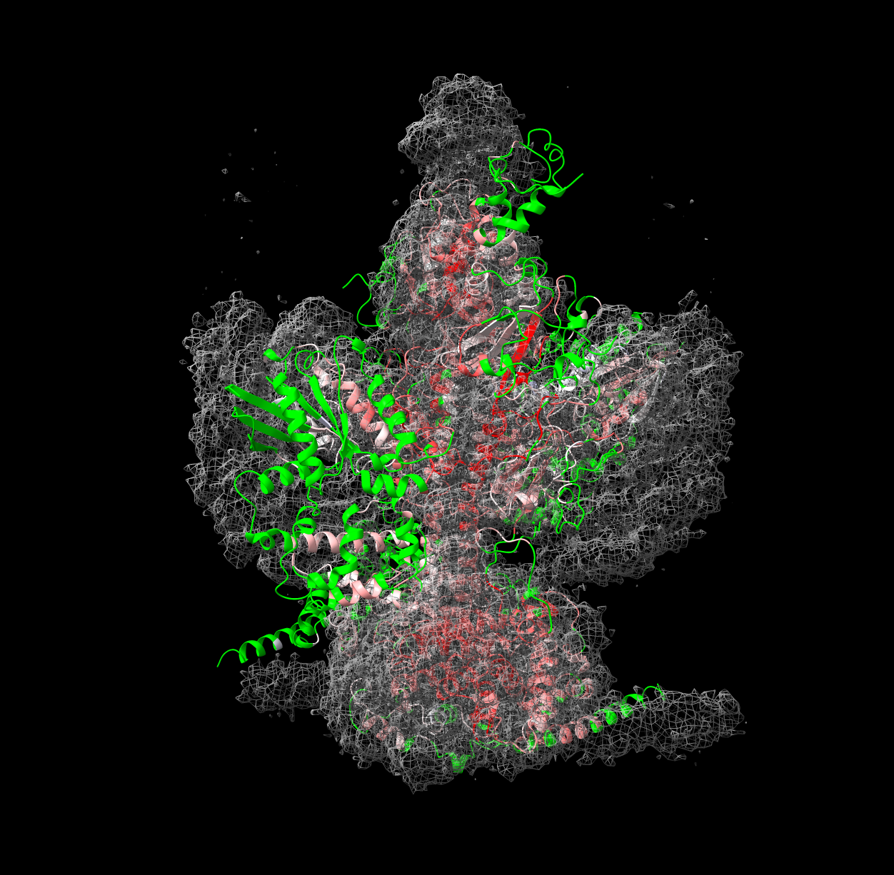
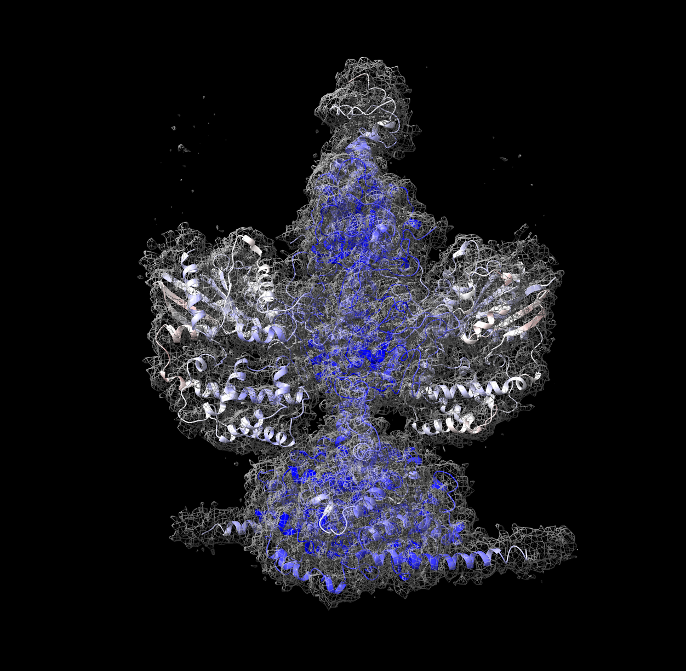
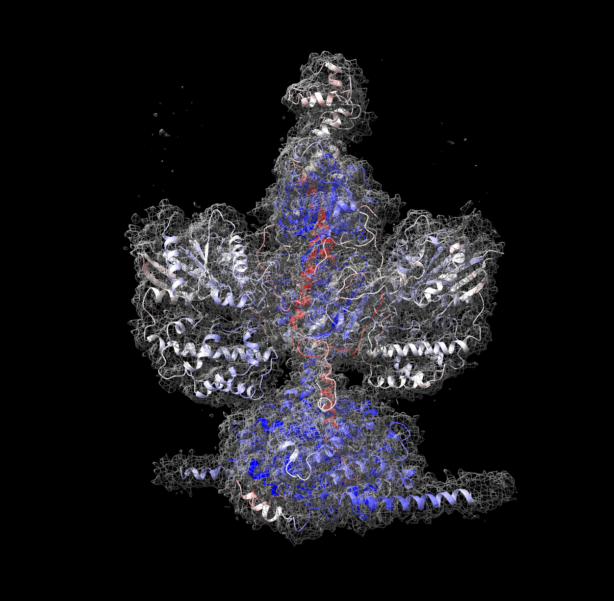

# DAQplugin

DAQplugin is a collection of tools for computing, visualizing, and exporting **DAQ scores** for protein atomic models in cryo-EM maps.

This repository provides:

- Google Colab ready Jupyter notebooks for DAQ score computation and NPY file generation [DAQ_Score_Grid.ipynb](https://colab.research.google.com/github/gterashi/DAQplugin/blob/main/DAQ_Score_Grid.ipynb)
- A ChimeraX plugin (`daqcolor`) for interactive coloring and visualization
- Command-line utilities for processing and file export

DAQ is included as a Git submodule to ensure consistency with published methods.

---

## Repository Structure

```
DAQplugin/
├── DAQ/                  # DAQ core (git submodule)
├── daqcolor/             # ChimeraX plugin
│   ├── src/
│   ├── bundle_info.xml
│   └── 00README.txt
├── cli/                  # Command-line scripts
├── map_util/             # Map preprocessing utilities
├── DAQ_Score.ipynb       # DAQ score calculation notebook
├── DAQ_Score_Grid.ipynb  # Grid / NPY generation notebook
├── daq_score_grid.py     # Standalone DAQ scoring script
├── README.md
└── LICENSE
```

---

## Installation

### Clone the Repository (IMPORTANT)

This repository uses **Git submodules**.

Clone with submodules enabled:

```bash
git clone --recurse-submodules https://github.com/gterashi/DAQplugin.git
```

If you already cloned without submodules:

```bash
git submodule update --init --recursive
```

---

## 1. DAQ Score Computation (Jupyter Notebook on Google Colab)

### Notebook

- [`DAQ_Score_Grid.ipynb`](https://colab.research.google.com/github/gterashi/DAQplugin/blob/main/DAQ_Score_Grid.ipynb)

### Purpose

This notebook computes:

- DAQ scores from atomic models (PDB/CIF) and cryo-EM maps (MRC/MAP)
- Numpy files (`.npy`) containing per-point probability and score information

The generated `.npy` files are used by the ChimeraX plugin (`daqcolor`) for visualization.

### Typical Workflow

1. Provide:
   - Atomic model (`.pdb` or `.cif`)
   - Cryo-EM map (`.mrc` or `.map`)
   - 
2. Run the notebook cells sequentially
3. Output:
   - `points_AA_ATOM_SS_swap.npy`
   - Optional: PDB file with DAQ score

---

## 2. ChimeraX Plugin: `daqcolor`

The `daqcolor` plugin enables **interactive coloring and visualization of DAQ scores** in ChimeraX.

### Installation (Developer Mode)

From the ChimeraX command line:

```bash
# Uninstall (if already installed)
devel clean [DAQplugin PATH]/daqcolor

# Install
devel install [DAQplugin PATH]/daqcolor
```

> **Note**  
> The `devel` command requires ChimeraX developer tools.

---

### Help

```bash
help daqcolor
```

---

### Commands

#### Apply DAQ coloring once

```
daqcolor apply npyPath model [k N] [half_window N] [colormap] [metric] [atomName] [clampMin] [clampMax]
```

- `npyPath` : Path to the numpy file computed by NoteBook.  
- `model`   : ChimeraX model ID (e.g., `#1`)  
- `k` : Number of nearest neighbors for kNN (default: 1)
- `half_window` : Window averaging half-width (n±half_window, default: 9)
- `colormap` : Optional colormap for visualization
- `metric`  :
  - `aa_score` — DAQ(AA) score  
  - `atom_score` — DAQ(CA) score  
  - `aa_conf:<AA>` — DAQ confidence for a specific amino-acid type  
- `atomName` : Atom name (default: CA)  
- `clampMin`, `clampMax` : Optional score clamping  

**Examples**

```bash
# Color model #2 by amino-acid DAQ score
daqcolor apply ./points_AA_ATOM_SS_swap.npy #2 metric aa_score 

# Color by atom (CA) DAQ score
daqcolor apply ./points_AA_ATOM_SS_swap.npy #1 metric atom_score
```

---

#### Live recoloring

```
daqcolor monitor model [npy_path npyPath] [k N] [half_window N] [colormap] [metric] [atomName] [on true|false]
```

**Parameters:**
- `model` : ChimeraX model ID (e.g., `#1`) - **required**
- `npy_path` : Path to the numpy file - **required when turning monitor on, not needed when turning off**
- `k` : Number of nearest neighbors for kNN (default: 1)
- `half_window` : Window averaging half-width (default: 9)
- `colormap` : Optional colormap for visualization
- `metric` : Scoring metric (`aa_score`, `atom_score`, or `aa_conf:<AA>`)
- `atomName` : Atom name (default: CA)
- `on` : Enable (`true`) or disable (`false`) monitoring (default: `true`)

**Examples:**

```bash
# Start monitoring (npy_path required)
daqcolor monitor #2 npy_path ./points_AA_ATOM_SS_swap.npy metric aa_score

# Stop monitoring (simpler - no npy_path needed)
daqcolor monitor #2 on false
```

**Notes:**
- If you run `daqcolor monitor` on the same model multiple times, it will automatically replace the previous monitor
- To stop monitoring, use `on false` without specifying the npy_path
### Example: EMD-22456 and mis-aligned model

- **Mis-aligned model**  
  Red indicates negative DAQ scores.  
  Green regions are located outside the contour level.

  

- **Aligned model using the `FitMap` command in ChimeraX**
 Blue indicates positive DAQ scores.
 
  

- **PDB 7JSN (version 1)**  
  DAQ detects modeling errors in this version 1.1 deposited model.  
  [RCSB PDB entry](https://www.rcsb.org/versions/7JSN)

  

---

#### Visualize point clouds

```
daqcolor points npyPath [radius] [metric] [colormap] [clampMin] [clampMax]
```

**Parameters:**
- `npyPath` : Path to the numpy file
- `radius` : Marker radius (default: 0.4)
- `metric` : Optional metric for coloring:
  - `aa_conf` — Maximum confidence across all amino acids
  - `aa_top:<AA>` — Confidence for a specific amino acid (e.g., `aa_top:ALA`)
- `colormap` : Optional colormap for visualization
- `clampMin`, `clampMax` : Optional score clamping

**Examples:**

```bash
# Show points without coloring
daqcolor points ./points_AA_ATOM_SS_swap.npy radius 0.6

# Show points colored by maximum confidence
daqcolor points ./points_AA_ATOM_SS_swap.npy radius 0.6 metric aa_conf

# Show points colored by specific amino acid confidence
daqcolor points ./points_AA_ATOM_SS_swap.npy radius 0.6 metric aa_top:ALA
```

### Clear markers:

```bash
daqcolor clear
```

---

### DAQ Score Computation (ChimeraX)

The `daqscore` commands allow you to compute DAQ scores directly within ChimeraX using ONNX Runtime inference.

#### Compute DAQ scores from a map

```bash
daqscore compute mapInput contour [output npyPath] [stride N] [batch_size N] [max_points N] [model modelPath] [monitor #model] [metric] [half_window N]
```

**Parameters:**
- `mapInput`: Path to MRC/MAP file OR ChimeraX Volume model (e.g., `#1`) - **required**
- `contour`: Contour threshold value - **required**
- `output`: Path to save output NPY file (auto-generated if not specified)
- `stride`: Stride for point sampling (default: 2, higher=faster but less dense)
- `batch_size`: Batch size for inference (default: 512)
- `max_points`: Maximum number of points to sample (default: 500000)
- `model`: Optional path to ONNX model file (uses bundled model if not specified)
- `monitor`: Optional structure model to auto-color and monitor
- `metric`: Coloring metric for monitoring (`aa_score`, `atom_score`, or `aa_conf:<AA>`, default: `aa_score`)
- `half_window`: Half window size for score smoothing (default: 9)

**Examples:**

```bash
# Compute from a file path
daqscore compute /path/to/map.mrc 0.5 output /path/to/output.npy

# Compute from loaded volume (contour value required)
daqscore compute #1 0.5

# Compute and auto-monitor structure
daqscore compute #1 0.5 monitor #2 metric aa_score half_window 9
```

---

#### Compute and apply coloring in one step

```bash
daqscore run mapInput contour structure [output npyPath] [stride N] [batch_size N] [max_points N] [model modelPath] [metric] [k N] [colormap] [half_window N]
```

This command combines computation and coloring in a single step.

**Parameters:**
- `mapInput`: Path to MRC/MAP file OR ChimeraX Volume model (e.g., `#1`) - **required**
- `contour`: Contour threshold value - **required**
- `structure`: Structure model to color (e.g., `#2`) - **required**
- `output`: Path to save output NPY file (auto-generated if not specified)
- `stride`: Stride for point sampling (default: 2)
- `batch_size`: Batch size for inference (default: 512)
- `max_points`: Maximum number of points to sample (default: 500000)
- `model`: Optional path to ONNX model file
- `metric`: Coloring metric (`aa_score`, `atom_score`, or `aa_conf:<AA>`, default: `aa_score`)
- `k`: Number of nearest neighbors for kNN (default: 1)
- `colormap`: Optional colormap for visualization
- `half_window`: Half window size for score smoothing (default: 9)

**Examples:**

```bash
# Load map and structure, then compute and color
open map.mrc
open model.pdb
daqscore run #1 0.5 #2 metric aa_score

# With custom parameters
daqscore run #1 0.5 #2 metric atom_score k 1 half_window 9
```

---

### Saving Colored Models

Once colored, models can be exported using ChimeraX:

Save #1 as colored.pdb
```bash
save colored.pdb #1
```

- DAQ scores are written to the **B-factor field**
- Window-averaged scores (defined by `halfwindow k`) are preserved
- Both PDB and CIF formats are supported

---

## 3. Command-Line Usage (CLI)
### DAQ Score Export to B-factor (CLI)

The script **daq_write_bfactor.py** writes DAQ-style scores into the B-factor field of a protein structure file (PDB or mmCIF), using the same scoring logic as the ChimeraX daqcolor plugin.

### Requirements
- Python 3.8+
- NumPy
- SciPy (optional, for fast kNN; NumPy fallback is used if unavailable)
- gemmi (required for PDB/mmCIF I/O)

### Install dependencies:
```
pip install numpy scipy gemmi
```

### Basic Usage
```
python daq_write_bfactor.py \
    -i model.cif \
    -p points_AA_ATOM_SS_swap.npy \
    -m aa_score \
    -o model.daq.b.cif
```

This command:

- Computes DAQ scores per residue
- Writes the scores to the B-factor field
- Preserves the input file format (PDB or mmCIF)

### Command-Line Options
```
-i, --input        Input structure file (.pdb/.cif/.mmcif) [required]
-o, --output       Output structure file (.pdb/.cif/.mmcif) [required]
-p, --points       Points file (N×32 numpy file) [required]

-m, --metric       Scoring metric:
                     aa_score        DAQ(AA) score (per-residue)
                     atom_score      DAQ(CA) score
                     aa_conf:ALA     Confidence for a specific AA type

--atom-name        Atom name used to define residue coordinates (default: CA)
-k                 Number of nearest neighbors for kNN (default: 1)
--radius           Distance cutoff for kNN in Å (default: 3.0; <=0 disables)
--half-window      Window averaging half-width (n±half_window, default: 9)
--no-window        Disable window averaging
--nan-fill         Value written when score is NaN/inf (default: 0.0)
```

### Scoring Metrics
- aa_score	DAQ score for the native residue type
- atom_score	DAQ score based on CA atom probability
- aa_conf:XXX	DAQ confidence for a specific amino acid (e.g. aa_conf:ALA)

### Window Averaging
By default, scores are smoothed using chain-aware window averaging:

Residues within
- residue_number ± half_window
(default: ±9 residues) are averaged
- Only residues in the same chain are considered
- Non-finite values are ignored

### Disable window averaging:
```
--no-window
```

---
## Notes

- DAQ is included as a submodule to ensure consistency with published methods.
- The ChimeraX plugin is intended for visualization and inspection.
- Numerical analysis should be performed via notebooks or CLI tools.
- This repository is under active development.

---

## License

See the `LICENSE` file for details.
